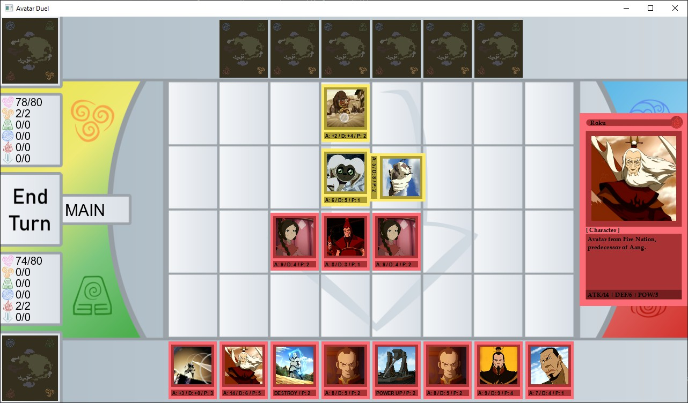

# Avatar Duel - The Game
This is a card dueling game themed around the Avatar franchise

## Overview (English)

Avatar Duel is a card trading game application which mechanics is based around Yu Gi Oh! and Magic: The Gathering. This game can be played by two players at once (local multiplayer). Each player puts down a card they have into the arena to battle with other players. Cards are divided into characters, lands, and skills. The game is also divided into several phases: draw phase, main phase, battle phase, and end phase. Each turn the players will go through those phases until the end phase before they switch turns. A player wins when the enemy's health reaches 0 or the enemy's deck becomes empty at their draw phase.

Avatar duel is an app run with a GUI using Java, JavaFX, and Gradle. Any assets, images, and information used in this application is taken from the [Avatar Wikia page](https://avatar.fandom.com/wiki/Avatar_Wiki) or is made by ourselves. Below are two screenshots of our application.

## Overview (Indonesian, Original)

Avatar Duel merupakan aplikasi trading card game yang pada dasarnya mirip dengan Yu Gi Oh! Dan Magic: The Gathering. Game ini dapat dimainkan oleh 2 pemain secara bersamaan. Pemain dapat meletakkan kartu yang dimiliki olehnya ke arena untuk bertarung dengan pemain lainnya. Kartu terbagi menjadi kartu Karakter, Land, dan Skill. Permainan sendiri juga terbagi menjadi beberapa fase, yaitu Draw Phase, Main Phase, Battle Phase, dan End Phase. Setiap giliran pemain dalam permainan akan menjalani fase-fase tersebut sehingga bila sudah melewati End Phase, pemain lawan akan menjadi giliran selanjutnya dalam permainan ini. Pemain dinyatakan menang jika HP lawan mencapai 0 atau kurang atau deck lawan kosong ketika Draw Phase.

Avatar Duel ini merupakan aplikasi yang dijalankan berbasiskan GUI dengan menggunakan bahasa pemrograman berupa Java dan framework berupa Gradle. Asset, gambar, dan informasi yang digunakan dalam aplikasi Avatar Duel ini diambil dari Avatar Wikia pada laman https://avatar.fandom.com/wiki/Avatar_Wiki. Berikut ini adalah dua buah screenshot terkait aplikasi Avatar Duel yang telah kami implementasikan.

## Getting Started
### Prerequisites
Our application requires the following.
* Java 8 (support JavaFX)
* Gradle Framework

### Installation
1. Download Java 8 from https://www.oracle.com/java/technologies/javase-jdk8-downloads.html
2. Install Java 8 by execute the installer
3. Add path to environment variables
`C:\Program Files\Java\jdk1.8.0_241\bin`
4. Download gradle from https://gradle.org/releases/
5. Extract gradle to certain directory
`C:\Gradle`
6. Add path to environment variables
`C:\Gradle\gradle-6.3\bin`

### Compiling the program
To compile the program, type this command into the directory containing gradlew.
```
./gradlew build
```

### Cara Menjalankan Program
To run the program, type this command into the directory containing gradlew.
```
./gradlew run
```
## Screenshot Aplikasi
The following is a screenshot of our application


## Project Structure
Below is the structure of our source code.
```
+---bin
+---build
|   +---docs
|       +---javadoc
|           index.html
|
+---src
    +---main
    |   +---java
    |       +---com
    |           +---avatarduel
    |               |   AvatarDuel.java
    |               +---card
    |               |      Aura.java
    |               |      Card.java
    |               |      Char.java
    |               |      Destroy.java
    |               |      Land.java
    |               |      PowerUp.java
    |               |      Skill.java
    |               +---gamemanager
    |               |      DataLoader.java
    |               |      GameManager.java
    |               |      IMouseClickSub.java
    |               |      IMouseMoveSub.java
    |               +---gamestate
    |               |      ArenaClickInfo.java
    |               |      BattlePhase.java
    |               |      DrawPhase.java
    |               |      EndPhase.java
    |               |      GameState.java
    |               |      Main1Phase.java
    |               |      RoundInfo.java
    |               +---model
    |               |      Element.java
    |               |      Land.java
    |               +---player
    |               |      Player.java
    |               |      PlayerArena.java
    |               |      PlayerStats.java
    |               +---sprite
    |               |      CardSprite.java
    |               |      CardText.java
    |               |      EndButton.java
    |               |      GameDrawer.java
    |               |      Sprite.java
    |               \---util
    |                      CSVReader.java
    |                      LongValue.java
    |               
    \-- test
        +---java
            +---com
                +---avatarduel
                    +---card
                    +---gamemanager
                    +---gamestate
                    +---model
                    +---player
                    |      PlayerStatsTest.java
                    +---sprite
                    \---util
```
## Unit Testing
To do unit testing, you can run the following command.
```
./gradle test --tests <NamaTest>
```
For example,
```
./gradle test --tests PlayerStatsTest
```
will run the test on PlayerStatsTest.java, if the build is successful, the testing should work.

## Documentation
To see the documentation, open the following file.
```./build/docs/javadoc/index.html```

## Team Members
IF2210 - Pemrograman Berorientasi Objek
Class K2 Group 10 Academic Year 2019-2020
- 13518056 - Michael Hans
- 13518065 - Fritz Gerald Tjie
- 13518089 - Annisa Rahim
- 13518107 - Chokyi Ozer
- 13518134 - Muhammad Raihan Iqbal

## Acknowledgments
* IF2210 K2 lecturer, Muhammad Zuhri Catur Candra, ST., MT
* Mentoring Assistant, Antonio Setya

## Credit
All images, assets, names, and descriptions are taken from [Avatar Wikia](https://avatar.fandom.com/wiki/Avatar_Wiki)
