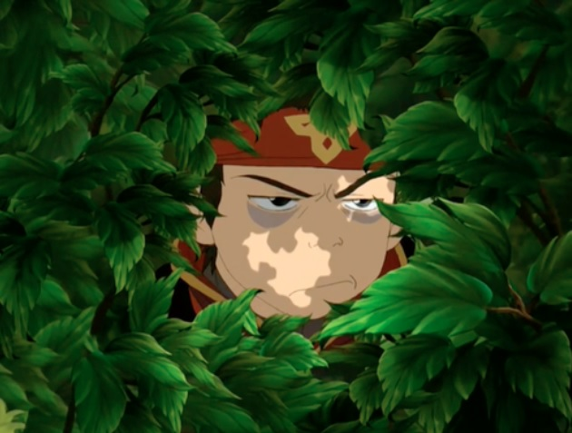

# Avatar Duel - The Game
## Overview


Avatar Duel merupakan aplikasi trading card game yang pada dasarnya mirip dengan Yu Gi Oh! Dan Magic: The Gathering. Game ini dapat dimainkan oleh 2 pemain secara bersamaan. Pemain dapat meletakkan kartu yang dimiliki olehnya ke arena untuk bertarung dengan pemain lainnya. Kartu terbagi menjadi kartu Karakter, Land, dan Skill. Permainan sendiri juga terbagi menjadi beberapa fase, yaitu Draw Phase, Main Phase, Battle Phase, dan End Phase. Setiap giliran pemain dalam permainan akan menjalani fase-fase tersebut sehingga bila sudah melewati End Phase, pemain lawan akan menjadi giliran selanjutnya dalam permainan ini. Pemain dinyatakan menang jika HP lawan mencapai 0 atau kurang atau deck lawan kosong ketika Draw Phase.

Avatar Duel ini merupakan aplikasi yang dijalankan berbasiskan GUI dengan menggunakan bahasa pemrograman berupa Java dan framework berupa Gradle. Asset, gambar, dan informasi yang digunakan dalam aplikasi Avatar Duel ini diambil dari Avatar Wikia pada laman https://avatar.fandom.com/wiki/Avatar_Wiki. Berikut ini adalah dua buah screenshot terkait aplikasi Avatar Duel yang telah kami implementasikan.

## Getting Started
### Prerequisites
Berikut ini adalah environment yang dibutuhkan.
* Java 8 (support JavaFX)
* Gradle Framework

### Installation
1. Download Java 8 from https://www.oracle.com/java/technologies/javase-jdk8-downloads.html
2. Install Java 8 by execute the installer
3. Add path to environment variables
`C:\Program Files\Java\jdk1.8.0_241\bin`
4. Download gradle from https://gradle.org/releases/
5. Extract gradle to certain directory
`C:\Gradle`
6. Add path to environment variables
`C:\Gradle\gradle-6.3\bin`

### Cara Compile Program
Untuk mengcompile program, ketik command ini dalam directory dimana terdapat gradlew.
```
./gradlew build
```

### Cara Menjalankan Program
Untuk menjalankan program, ketik command ini dalam directory dimana terdapat gradlew.
```
./gradlew run
```
## Screenshot Aplikasi
Berikut ini adalah screenshot dari aplikasi kami.


## Project Structure
Berikut ini adalah struktur folder dari Avatar Duel.
```
+---bin
+---build
|   +---docs
|       +---javadoc
|           index.html
|
+---src
    +---main
    |   +---java
    |       +---com
    |           +---avatarduel
    |               |   AvatarDuel.java
    |               +---card
    |               |      Aura.java
    |               |      Card.java
    |               |      Char.java
    |               |      Destroy.java
    |               |      Land.java
    |               |      PowerUp.java
    |               |      Skill.java
    |               +---gamemanager
    |               |      DataLoader.java
    |               |      GameManager.java
    |               |      IMouseClickSub.java
    |               |      IMouseMoveSub.java
    |               +---gamestate
    |               |      ArenaClickInfo.java
    |               |      BattlePhase.java
    |               |      DrawPhase.java
    |               |      EndPhase.java
    |               |      GameState.java
    |               |      Main1Phase.java
    |               |      RoundInfo.java
    |               +---model
    |               |      Element.java
    |               |      Land.java
    |               +---player
    |               |      Player.java
    |               |      PlayerArena.java
    |               |      PlayerStats.java
    |               +---sprite
    |               |      CardSprite.java
    |               |      CardText.java
    |               |      EndButton.java
    |               |      GameDrawer.java
    |               |      Sprite.java
    |               \---util
    |                      CSVReader.java
    |                      LongValue.java
    |               
    \-- test
        +---java
            +---com
                +---avatarduel
                    +---card
                    +---gamemanager
                    +---gamestate
                    +---model
                    +---player
    |               |      PlayerStatsTest.java
                    +---sprite
                    \---util
```
## Unit Testing
Untuk menjalankan unit testing, Anda dapat menjalankan command ini dalam terminal.
```./gradle test --tests <NamaTest>```
Sebagai contoh
```./gradle test --tests PlayerStatsTest```
Akan menjalankan test pada PlayerStatsTest.java, jika build successful, maka testing berhasil.

## Documentation
Untuk mengakses dokumentasi, Anda dapat membuka file berikut ini.
```./build/docs/javadoc/index.html```

## Author
IF2210 - Pemrograman Berorientasi Objek
Kelas K2 Kelompok 10 Tahun Ajaran 2019-2020
- 13518056 - Michael Hans
- 13518065 - Fritz Gerald Tjie
- 13518089 - Annisa Rahim
- 13518107 - Chokyi Ozer
- 13518134 - Muhammad Raihan Iqbal

## Acknowledgments
* Dosen IF2210 K2, Muhammad Zuhri Catur Candra, ST., MT
* Asisten Pembimbing, Antonio Setya

## Credit
Semua asset, image, deskripsi diambil dari [Avatar Wikia](https://avatar.fandom.com/wiki/Avatar_Wiki)
